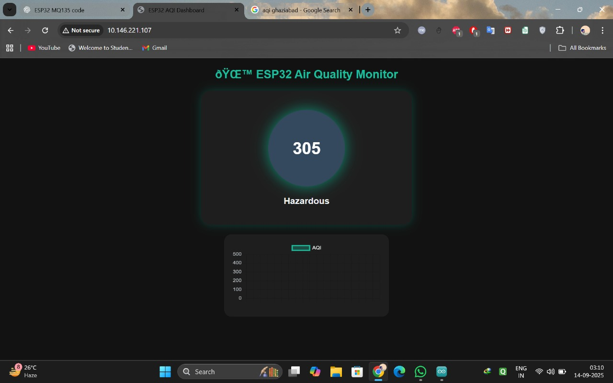

# ESP32 Air Quality Monitoring System 🌍

A physically implemented air quality monitoring system built using **ESP32** and MQ-series gas sensors.  
The system senses real-world air quality parameters, estimates Air Quality Index (AQI) levels, and displays the results on a **real-time web dashboard hosted directly on the ESP32**.

This project focuses on embedded sensing, on-device data processing, and lightweight web-based visualization.

---

## 🚀 Features
- Physically implemented system using gas sensors
- ESP32-based embedded web server (no external backend)
- Real-time AQI estimation from sensor readings
- Dark-themed, responsive web dashboard
- Automatic page refresh every 5 seconds
- Compact and efficient firmware design

---

## 🛠️ Hardware Components
- ESP32 Dev Module  
- MQ2 Gas Sensor  
- MQ135 Gas Sensor *(available for extended air quality sensing)*  
- Connecting wires and power supply  
- Wi-Fi network  

---

## 📊 AQI Classification
The estimated AQI values are categorized into standard air quality levels:

| AQI Range | Air Quality Level |
|----------|------------------|
| 0–50     | Good |
| 51–100   | Moderate |
| 101–150  | Unhealthy (Sensitive Groups) |
| 151–200  | Unhealthy |
| 201–300  | Very Unhealthy |
| 301–500  | Hazardous |

---

## 🌐 Web Dashboard
- Displays real-time AQI values
- Shows corresponding air quality status
- Hosted directly on the ESP32 using an embedded HTTP server
- Accessible through the ESP32’s local IP address on any browser

---

## ⚙️ System Workflow
1. MQ gas sensors measure air quality parameters
2. ESP32 reads analog sensor data through ADC pins
3. Raw sensor values are scaled to estimate AQI
4. AQI values are mapped to standard air quality categories
5. Data is served via an embedded web server
6. Web dashboard auto-refreshes to display updated readings

---

## 🧪 Calibration Method
A linear calibration approach is used for AQI estimation:

AQI = Raw_ADC × Calibration_Factor

The calibration factor was derived experimentally based on observed sensor behavior and can be adjusted for different environments.

---

## 📂 Project Structure
ESP32-Air-Quality-Monitor/  
├── esp32_aqi_dashboard.ino  
├── README.md  
└── ui_dashboard.jpg

---

## ▶️ How to Run
1. Connect the MQ sensors to the ESP32 ADC pins  
2. Open the `.ino` file in Arduino IDE  
3. Select **ESP32 Dev Module** as the board  
4. Enter your Wi-Fi credentials in the code  
5. Upload the sketch to the ESP32  
6. Open Serial Monitor to obtain the ESP32 IP address  
7. Open the IP address in a web browser to view the dashboard  

---

## 🔒 Security Note
Wi-Fi credentials are kept as placeholders in the repository.  
Update them locally before flashing the firmware.

---

## 📌 Limitations
- AQI values are approximate and not reference-grade
- MQ sensors are sensitive to environmental conditions
- Proper voltage scaling is required for reliable ADC readings

---

## 🚧 Future Improvements
- Improved MQ135 integration with proper voltage division
- Sensor data smoothing and filtering
- Historical AQI visualization
- TinyML-based AQI trend prediction
- Cloud-based data logging and dashboards

---

## 📷 Screenshots
Project screenshots showing the live web dashboard:

---

## 📄 License
This project is open-source and intended for educational and learning purposes.
